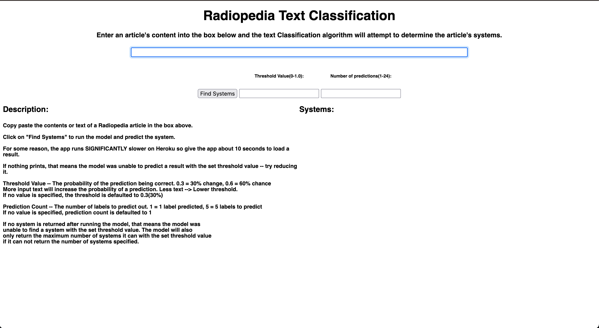
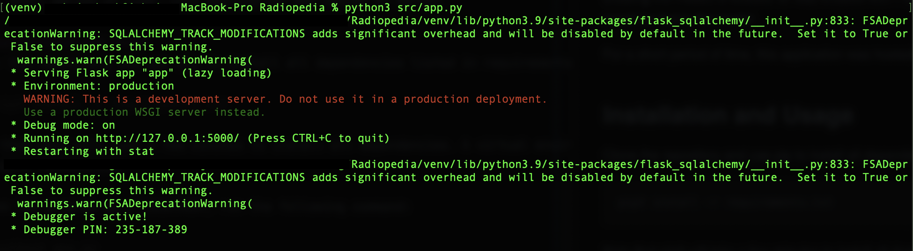
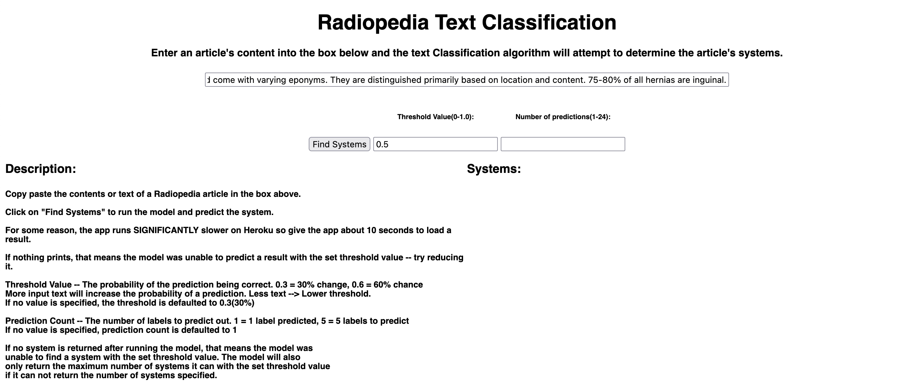
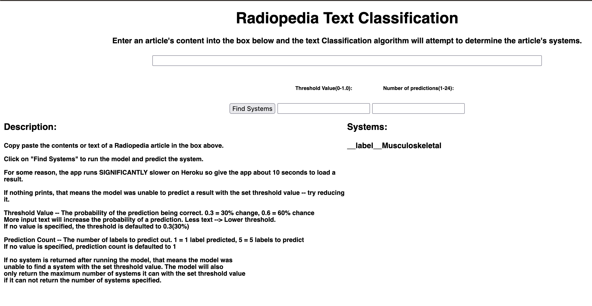

# Radiopaedia-Text-Classification

## About
A text classification tool for Radiopaedia. Radiopaedia is an encyclopedia
specifically tailored towards Radiology. Radiopaedia contains thousands of articles
regarding various topics. This tool aims to classify text into a specific human body
system. For example, text regarding information about the heart would be classified
under the cardiac system. If a user may be interested in researching a particular
topic further, they can enter in text and this tool will recommend a system where
the user can find more articles regarding their topic.

## Continuing Development
The Radiopaedia-Text-Classification tool was an exercise and a proof of concept
for me to further my understanding of Natural Language Processing and Machine
Learning. Consequently, this project is no longer maintained or developed. If you
are interested in continuing this project, feel free to do so by forking the respository.

## Technologies Used
* This project relied heavily on Facebook's fastText text classification library.
* BeautifulSoup was used to scrape Radiopaedia's website to download and create raw
data.
* NLTK was then used to pre-process the data in a format that Facebook's fastText
library would be able to train and test itself on.

44% of the total data created was partitioned for training and 19% was partitioned
for testing (the testing and training set were pulled from disjoint sets of data).
After creating the model, a website UI was created with Flask to enable the user to
provide input which would be fed to the model.

For a short period of time, this application was hosted on Heroku.

## Installation and Usage
Clone the repository and use pip to install all dependencies listed in requirements.txt.

    pip3 install -r requirements.txt

Note that pip3 will take a few minutes to install all dependencies. A virtual environment
is highly recommended. Make sure to cd to the directory where this repository is cloned.

To run the program as a localhost, run the following command:

    python3 app.py

This will create the local server and output the IP address that will be needed
to connect. Opening your preferred browser and entering the IP address specified
will load the web app. 

Note that a model_classification.bin must exist before
executing this command. If no such model exists, you will need to interactively
use the classification.py program. You can create the model by running the command:

    python3 -i classification.py

and then

    >>> create_model()

Note that doing so will take a few minutes to complete since the model is trained
with massive amounts of data. The main reason why the model is not on this
repository is because it is nearly 900 MB in size which exceeds the limits of any file
on Github and Git.

Once the web application is operating, you will be greeted with the following screen:

You are given the option to enter in text from an article and the tool will attempt
to predict which system the topic of the article belongs in. For example, pasting a
snippet from an article regarding 
[abdominal hernia](https://radiopaedia.org/articles/abdominal-hernia?lang=us)
is correlated with the Gastrointestinal and Musculoskeletal systems. Pasting
a small snippet from that article with a minimum 50% accuracy yields the
following result.

So the system was correctly able to predict that the snippet would belong to an
article in the Musculoskeletal system. However, the model failed to also predict
that the article could belong to the Gastrointestinal system indicating potential
future improvements to the model.

## Future Steps && Known Issues
Some key features to improve on would include:
* Completely reworking the UI for a more interactive and responsive user experience
* Applying improved training for the model and optimizing the settings for optimal 
performance.
* Data scraping methods could be improved to yield higher quality data for a more 
accurate model.
* Compiling data from more sources than Radiopaedia and offering more options to make
predictions more nuanced with respect to the user's intentions.
* Resolving the "Central Nervous System" bug. Currently, the model will parse 'Central',
'Nervous' and 'System' as separate entities when really all three constitute 1 value.
    * This is a concerning issue but considering the project is a proof of concept 
    and not released for production, it is trivial in scope.
